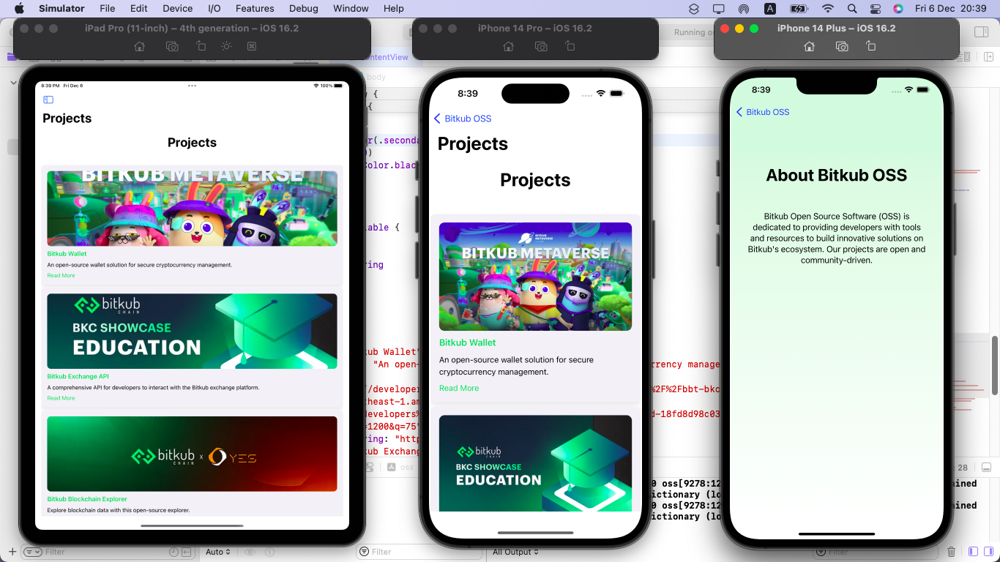
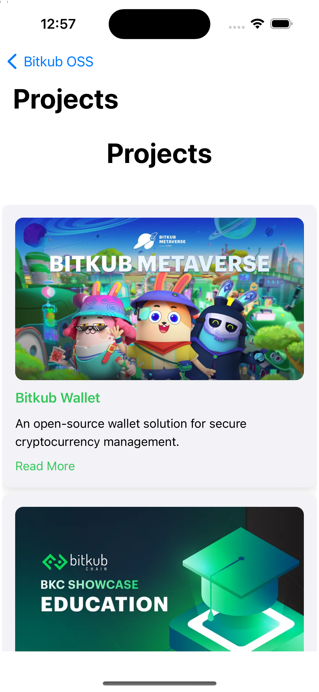
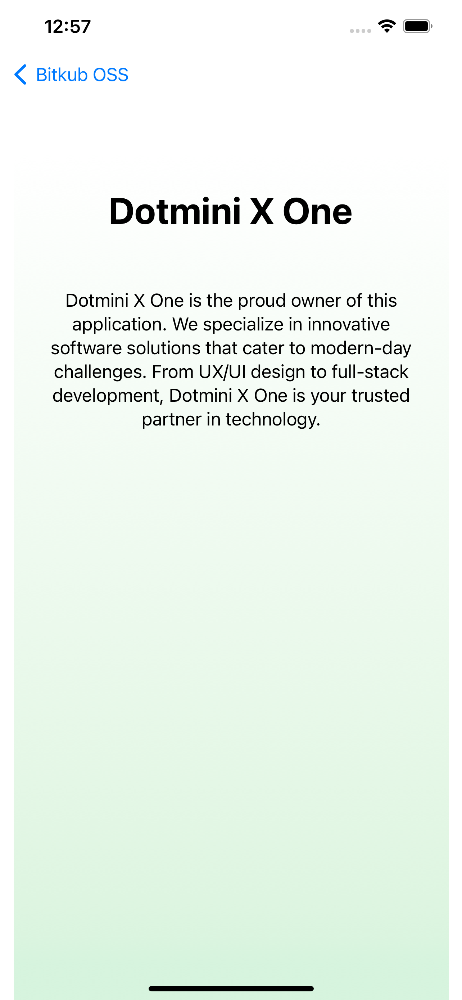

# Bitkub OSS Application

Welcome to the **Bitkub OSS Application** repository! This application is built using **SwiftUI** and showcases the open-source software (OSS) ecosystem of **Bitkub**. Explore projects, learn about our mission, and stay updated with the latest news from **Dotmini X One**.

## Features

- **Projects Page**: View a curated list of open-source projects and their details.

- **About Page**: Learn about the mission and vision of Bitkub OSS.

- **Dotmini X One Page**: Discover more about the company and its innovative software solutions.

- **Newsroom Page**: Stay updated with the latest news and articles from Dotmini X One.

- **Responsive Design**: Optimized for different devices, including iPads and iPhones.

## Screenshots

### Home Page



### Projects Page



### Newsroom Page



## Installation

To run this project locally, follow these steps:

1\. **Clone the repository**:

   ```bash

   git clone https://github.com/yourusername/bitkub-oss-app.git

   ```

2\. **Open the project in Xcode**:

   ```bash

   cd bitkub-oss-app

   open BitkubOSS.xcodeproj

   ```

3\. **Run the project**:

   - Select a simulator or connected device.

   - Click the `Run` button in Xcode.

## Requirements

- **Xcode 13+**

- **iOS 14+**

## Technologies Used

- **SwiftUI**: For building a modern and responsive user interface.

- **AsyncImage**: To fetch and display images dynamically.

- **NavigationView** and **LazyVGrid**: For intuitive navigation and responsive layouts.

- **Gradient Backgrounds**: For enhanced visuals.

## How to Contribute

We welcome contributions! Here's how you can get involved:

1\. Fork the repository.

2\. Create a new feature branch.

3\. Commit your changes.

4\. Submit a pull request with a detailed description of your changes.

## About Dotmini X One

**Dotmini X One** is a leader in software innovation, specializing in modern UX/UI design, full-stack development, and cutting-edge solutions. Our mission is to empower developers and businesses with exceptional tools and technologies.

Visit our [website](https://www.dotminixone.com) to learn more.

## License

This project is licensed under the [MIT License](LICENSE). Feel free to use, modify, and distribute the application in compliance with the license.

## Contact

For inquiries or support, please contact us:

- **Email**: [dev@dotmini.in.th](mailto:dev@dotmini.in.th)
